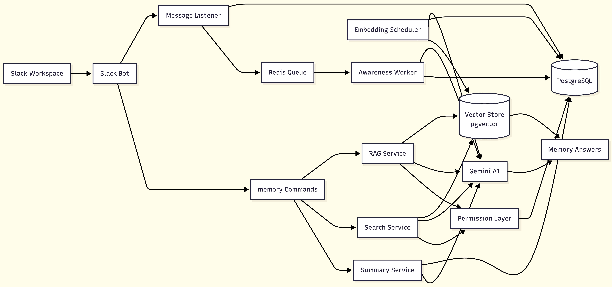

# Yikes

**Your Slack workspace has a memory problem. Yikes fixes it.**

Every decision, every discussion, every "we talked about this last month" — captured, embedded, and queryable. Not ephemeral summaries. Persistent, searchable, structured memory for your entire team.

---

## Why not just use Slack AI?

| | Slack AI | Yikes |
|---|---|---|
| **Storage** | Ephemeral — summaries disappear | Persistent PostgreSQL with full audit trail |
| **Search** | Keyword only | Hybrid vector + keyword (semantic search) |
| **Decision tracking** | None | Auto-detected decision ledger per channel |
| **Context window** | Per-session, resets | Per-user per-channel, 2hr session memory |
| **Access control** | Slack-native only | Channel-gated at SQL level — private channel data never leaks |
| **Extensibility** | Closed | Open — Notion, GitHub, Google Docs integrations planned |
| **Data ownership** | Slack's servers | Your Supabase instance |
| **Cost at scale** | Per-seat licensing | Infrastructure cost only |

---

## Architecture



**Ingestion pipeline:** Every Slack message hits the `message` event listener → stored to PostgreSQL → pushed to BullMQ (Redis) → Awareness Worker enriches it with Gemini AI (classification, entity extraction, importance scoring) → thread dirty flag set.

**Embedding pipeline:** `node-cron` scheduler runs every 5 minutes → picks up dirty threads → builds full thread content → generates 768-dim vector via `gemini-embedding-001` → stored in `thread_embeddings` with HNSW index.

**Query pipeline:** `/memory` command → membership gate (user's accessible channels resolved) → hybrid vector + keyword search against `thread_embeddings` → Gemini generates answer with context injection → ephemeral or public response.

---

## Stack

- **Runtime:** Node.js + Slack Bolt SDK
- **Database:** PostgreSQL on Supabase (pgvector enabled)
- **Queue:** BullMQ + Redis (RedisLabs)
- **AI:** Gemini 2.5 Flash (classification + generation) + `gemini-embedding-001` (768-dim vectors)
- **Scheduler:** node-cron
- **Tunnel (dev):** ngrok

---

## Setup

### Prerequisites

- Node.js 18+
- Supabase project (pgvector extension enabled)
- Redis instance (RedisLabs free tier works)
- Slack app with the following scopes: `channels:history`, `channels:read`, `chat:write`, `commands`, `users:read`, `groups:read`, `im:read`, `mpim:read`
- Gemini API key

### 1. Clone and install

```bash
git clone https://github.com/your-username/Yikes.git
cd Yikes
npm install
```

### 2. Environment variables

Create `.env` in the project root:

```bash
SLACK_BOT_TOKEN=xoxb-...
SLACK_SIGNING_SECRET=...
GEMINI_API_KEY=...
REDIS_URL=redis://...
DATABASE_URL=postgresql://postgres.<ref>:<password>@aws-0-<region>.pooler.supabase.com:6543/postgres
PORT=4390
```

### 3. Database setup

Run the following in your Supabase SQL editor. Order matters — run extensions first.

**Step 1 — Enable extensions**
```sql
create extension if not exists "uuid-ossp";
create extension if not exists vector;
```

**Step 2 — Create tables**
```sql
-- Messages (core ingestion store)
create table messages (
  id uuid primary key default uuid_generate_v4(),
  workspace_id text not null,
  channel_id text not null,
  user_id text not null,
  thread_ts text,
  text text,
  slack_timestamp text not null,
  channel_type text,
  raw_payload jsonb not null,
  message_type text,
  importance_score double precision,
  entities jsonb,
  topic_tags jsonb,
  edited_at timestamptz,
  deleted boolean default false,
  deleted_at timestamp,
  processed boolean default false,
  created_at timestamptz default now()
);

-- Thread embeddings (vector store)
-- Note: primary key is on id; (workspace_id, channel_id, thread_ts) is a separate unique constraint
create table thread_embeddings (
  id uuid primary key default gen_random_uuid(),
  workspace_id text not null,
  channel_id text not null,
  thread_ts text not null,
  content text,
  embedding vector(768),
  message_count integer default 1,
  last_message_at timestamptz,
  needs_embedding boolean default true,
  embedded_at timestamptz,
  created_at timestamptz default now(),
  updated_at timestamptz default now(),
  unique (workspace_id, channel_id, thread_ts)
);

-- Users (display name cache — avoids Slack API rate limits)
create table users (
  workspace_id text not null,
  user_id text not null,
  display_name text not null,
  avatar_url text,
  fetched_at timestamptz default now(),
  primary key (workspace_id, user_id)
);

-- Interaction log (audit trail + context window)
create table interaction_log (
  id uuid primary key default gen_random_uuid(),
  workspace_id text not null,
  user_id text not null,
  channel_id text not null,
  command_type text not null,
  input text,
  output text not null,
  metadata jsonb default '{}'::jsonb,
  created_at timestamptz default now()
);

-- Channel memberships (security — gates all queries)
create table user_channel_memberships (
  workspace_id text not null,
  user_id text not null,
  channel_id text not null,
  is_private boolean default false,
  synced_at timestamptz default now(),
  primary key (workspace_id, user_id, channel_id)
);
```

**Step 3 — Create indexes**
```sql
-- messages: deduplication + query performance
create unique index unique_slack_message on messages (workspace_id, channel_id, slack_timestamp);
create index idx_workspace on messages (workspace_id);
create index idx_channel on messages (channel_id);
create index idx_user on messages (user_id);
create index idx_thread on messages (thread_ts);
create index idx_created_at on messages (created_at);
create index idx_messages_processed on messages (processed);

-- thread_embeddings: HNSW vector index (cosine similarity, 768-dim)
create index thread_embeddings_embedding_idx on thread_embeddings
using hnsw (embedding vector_cosine_ops)
with (m = 16, ef_construction = 64);

-- interaction_log: context window lookup
create index idx_interaction_log_context
on interaction_log (workspace_id, user_id, channel_id, command_type, created_at desc);

-- user_channel_memberships: membership gate lookup
create index idx_memberships_lookup
on user_channel_memberships (workspace_id, user_id);
```

> **Note on HNSW:** `m = 16` controls graph connectivity (higher = better recall, more memory). `ef_construction = 64` controls build-time search depth (higher = better quality index, slower build). These values are well-balanced for most team sizes — only tune if you're storing 100k+ threads.

### 4. Slack app configuration

**Step 1 — Create your app**

Go to [api.slack.com/apps](https://api.slack.com/apps) → **Create New App** → **From scratch** → name it `Yikes` → select your workspace.

**Step 2 — OAuth scopes**

Go to **OAuth & Permissions** → scroll to **Bot Token Scopes** → add all of the following:

| Scope | Why it's needed |
|---|---|
| `channels:history` | Read messages from public channels |
| `channels:read` | List public channels (membership sync) |
| `chat:write` | Post responses and ephemeral messages |
| `commands` | Register and handle `/memory` slash command |
| `groups:history` | Read messages from private channels |
| `groups:read` | List private channels (membership sync) |
| `im:history` | Required by Slack even though DMs are blocked at ingestion |
| `im:read` | List DMs (membership sync — bot never stores DM content) |
| `mpim:history` | Same as above for group DMs |
| `mpim:read` | List group DMs |
| `users:read` | Resolve user display names |

Then click **Install to Workspace** and copy the **Bot User OAuth Token** (`xoxb-...`) into your `.env` as `SLACK_BOT_TOKEN`.

**Step 3 — Signing secret**

Go to **Basic Information** → **App Credentials** → copy **Signing Secret** into `.env` as `SLACK_SIGNING_SECRET`.

**Step 4 — Event subscriptions**

Go to **Event Subscriptions** → toggle **Enable Events** → set the Request URL to:
```
https://your-domain/slack/events
```

Under **Subscribe to bot events** add:
| Event | Why |
|---|---|
| `message.channels` | Ingest public channel messages |
| `message.groups` | Ingest private channel messages |
| `app_mention` | Handle `@Yikes` mentions |

> For local dev: start ngrok first (`ngrok http 4390`), use the generated `https://xxxx.ngrok.io` URL here. Slack will verify the URL — your server must be running.

**Step 5 — Slash command**

Go to **Slash Commands** → **Create New Command**:

| Field | Value |
|---|---|
| Command | `/memory` |
| Request URL | `https://your-domain/slack/events` |
| Short Description | `Query your workspace memory` |
| Usage Hint | `ask [question] \| search [query] \| summarize \| decisions \| save` |

**Step 6 — Reinstall**

Any time you add new scopes, go to **OAuth & Permissions** → **Reinstall to Workspace**. The bot token stays the same.

### 5. Run

```bash
# Development (with ngrok)
ngrok http 4390
# Set your ngrok URL in Slack app settings

npm start
```

---

## Commands

| Command | Description |
|---|---|
| `/memory ask <question>` | Ask anything about your workspace history — RAG-powered answer with context |
| `/memory search <query>` | Hybrid semantic + keyword search — returns threads with similarity scores and deep-links |
| `/memory summarize` | AI summary of the last 7 days in the current channel |
| `/memory decisions` | Decisions ledger for the current channel — auto-detected by AI |
| `/memory save` | Force-embed the last 30 minutes of this channel immediately |
| `/memory save <link>` | Force-embed a specific thread immediately via message permalink |

---

## Security model

- **DMs are never ingested** — `im` and `mpim` channel types are blocked at the listener level
- **Channel-gating at SQL level** — every search query is scoped to channels the requesting user is a member of
- **Membership cache** — synced from Slack API with a 10-minute TTL; stale cache triggers re-sync before any query
- **Audit trail** — every command interaction logged to `interaction_log` including which channels were exposed

---

## Roadmap

- [x] Phase 1–3 — Infrastructure, storage, embedding + RAG pipeline
- [x] Phase 4 — Knowledge layer (ask, search, summarize, decisions, context window)
- [x] Security hardening — channel-gating, membership sync, DM blocking
- [ ] Phase 5 — Slack UX (Home Tab dashboard, daily summary cron, weekly digest)
- [ ] Phase 6 — External integrations (Notion, GitHub, Google Docs, webhooks)
- [ ] Phase 7 — Web dashboard (Next.js, analytics, billing)

---

## License

MIT
